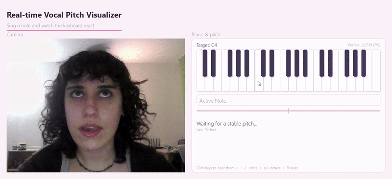

# 🎤 Real-time Vocal Pitch Visualizer 🎹  
A desktop application for real-time vocal pitch detection, piano visualization, and interactive practice mode — built with Python, Pygame, Aubio, NumPy, and OpenCV.

<p align="center">
  
</p>

---

## ✨ Features

### 🎵 Real-time Pitch Detection
- Microphone input processed at high resolution  
- Converts frequency → musical note (MIDI)  
- Cents deviation shown in a tuner-style bar  
- Smooth stabilized pitch updates  

### 🎹 Interactive Piano Keyboard
- Highlights the detected pitch in real-time  
- Black/white key geometry with soft shadows  
- Click any key to hear a synthesized harmonic tone  
- Pastel-pink aesthetic for a soft, modern UI  
- Clicked keys flash briefly for tactile feedback  

### 🎯 Practice Mode
- Set a target note (arrow keys)  
- Real-time scoring: Perfect / Close / Miss  
- Tracks accuracy percentage  
- Useful for vocal warmups & training  

### 📷 Camera Panel
- Shows live webcam feed  
- Makes the UI ideal for screen recordings & demos  

---

## 🚀 Installation

### 1. Clone the repository
```bash
git clone https://github.com/YOUR-USERNAME/pitch-visualizer.git
cd pitch-visualizer
